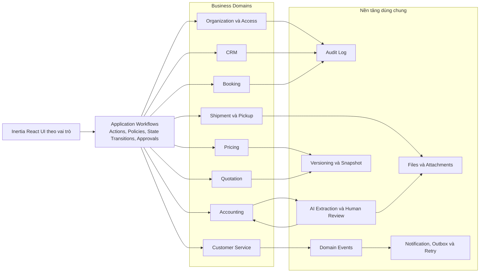
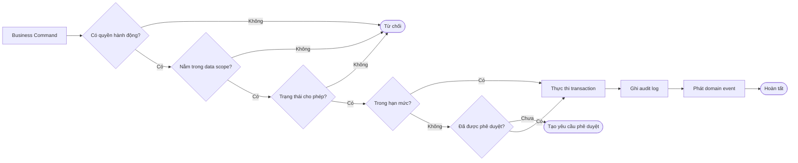
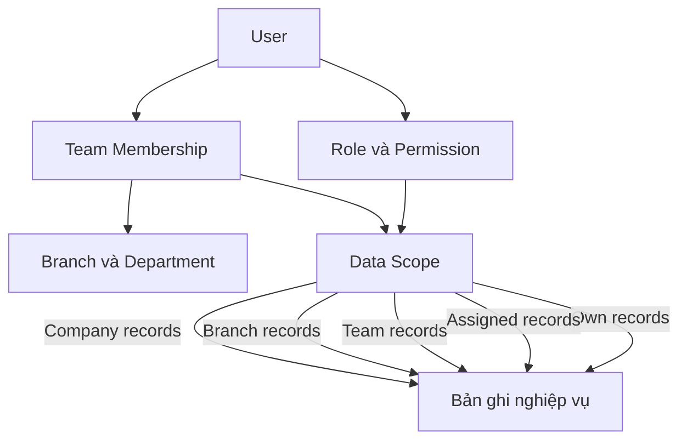
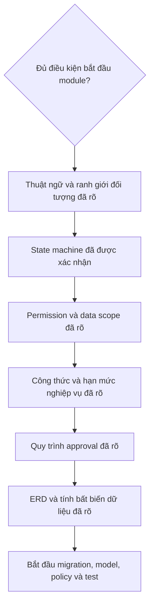

# Sơ đồ tổng thể hệ thống

## 1. Vai trò của tài liệu

Tài liệu này là bản đồ định hướng khi triển khai hệ thống. Mọi module mới cần được đối chiếu với:

- Luồng nghiệp vụ xuyên phòng ban.
- Ranh giới trách nhiệm của từng domain.
- Các lớp kiểm soát dùng chung.
- Thứ tự triển khai MVP.

Chi tiết và trạng thái xác nhận của từng quy tắc vẫn được quản lý tại `BUSINESS_LOGIC.md`. Kế hoạch triển khai chi tiết được quản lý tại `IMPLEMENTATION_PLAN.md`.

## 2. Sơ đồ nghiệp vụ xuyên suốt

```mermaid
flowchart TD
    START([Khách hàng phát sinh nhu cầu])

    subgraph CRM[CRM và Sales]
        C1[Tạo hoặc cập nhật khách hàng]
        C2[Phân loại và kiểm tra trùng]
        C3[Phân công Sales phụ trách]
        C4[Sales ghi nhận nhu cầu]
        C5[Tạo Rate Inquiry]
    end

    subgraph PRICING[Pricing và Ban Lãnh Đạo]
        P1[Pricing tiếp nhận Rate Inquiry]
        P2[Thu thập giá từ các hãng]
        P3[Chuẩn hóa giá, phụ phí và điều kiện]
        P4[Lập bộ giá đề xuất]
        P5{Ban Lãnh Đạo duyệt?}
        P6[Pricing điều chỉnh phiên bản]
        P7[Giá gốc được Approved]
        P8[Pricing công bố giá]
        P9[Sales Manager thiết lập phạm vi deal]
    end

    subgraph QUOTE[Báo giá]
        Q1[Sales lựa chọn phương án]
        Q2[Tính giá bán và margin]
        Q3{Trong phạm vi deal?}
        Q4[Yêu cầu phê duyệt ngoại lệ]
        Q5{Ngoại lệ được duyệt?}
        Q6[Tạo phiên bản Quotation]
        Q7[Lưu snapshot dữ liệu giá]
        Q8[Gửi báo giá cho khách hàng]
        Q9{Khách hàng chấp nhận?}
        Q10[Điều chỉnh hoặc đóng báo giá]
    end

    subgraph BOOKING[Booking và bàn giao]
        B1[Tạo Booking từ Quotation]
        B2[Sales hoàn thành checklist]
        B3[Bàn giao sang Operations]
        B4{Operations kiểm tra đủ dữ liệu?}
        B5[Trả Sales bổ sung]
        B6[Operations tiếp nhận Booking]
    end

    subgraph OPS[Operations và Pickup]
        O1[Phân công Operations Staff]
        O2[Tạo Shipment và kế hoạch vận hành]
        O3[Phân công Pickup Task]
        O4[Pickup thực hiện và tải bằng chứng]
        O5[Operations cập nhật milestone]
        O6{Có sự cố?}
        O7[Ghi nhận, xử lý hoặc escalation]
        O8[Operationally Completed]
    end

    subgraph CS[Customer Service]
        S1[Theo dõi sự kiện Shipment]
        S2[Thông báo và hỗ trợ khách hàng]
        S3{Phát sinh yêu cầu hoặc khiếu nại?}
        S4[Tạo và phân công Ticket]
        S5[Xử lý hoặc chuyển bộ phận liên quan]
        S6[Resolved và Closed]
    end

    subgraph ACC[Accounting và công nợ]
        A1[Đối soát doanh thu và chi phí]
        A2[Lập và phát hành Invoice]
        A3[Tạo khoản phải thu]
        A4[Theo dõi hạn thanh toán]
        A5{Đã thanh toán đủ?}
        A6[Ghi nhận và phân bổ Payment]
        A7[Gửi cảnh báo công nợ]
        A8{Vượt hạn hoặc hạn mức?}
        A9[Escalation và phê duyệt xử lý]
        A10[Hoàn tất nghiệp vụ]
    end

    START --> C1 --> C2 --> C3 --> C4 --> C5
    C5 --> P1 --> P2 --> P3 --> P4 --> P5
    P5 -- Không --> P6 --> P4
    P5 -- Có --> P7 --> P8 --> P9
    P9 --> Q1 --> Q2 --> Q3
    Q3 -- Không --> Q4 --> Q5
    Q5 -- Không --> Q10
    Q5 -- Có --> Q6
    Q3 -- Có --> Q6
    Q6 --> Q7 --> Q8 --> Q9
    Q9 -- Không --> Q10
    Q10 -. Tạo phiên bản mới nếu tiếp tục .-> Q1
    Q9 -- Có --> B1 --> B2 --> B3 --> B4
    B4 -- Không --> B5 --> B2
    B4 -- Có --> B6 --> O1 --> O2 --> O3 --> O4 --> O5 --> O6
    O6 -- Có --> O7 --> O5
    O6 -- Không --> O8
    O5 -. Sự kiện trạng thái .-> S1
    O7 -. Sự cố .-> S1
    S1 --> S2 --> S3
    S3 -- Có --> S4 --> S5 --> S6
    S3 -- Không --> S1
    O8 --> A1 --> A2 --> A3 --> A4 --> A5
    A5 -- Có --> A6 --> A10
    A5 -- Chưa --> A7 --> A8
    A8 -- Có --> A9 --> A4
    A8 -- Không --> A4
```



## 3. Sơ đồ ranh giới domain



## 4. Sơ đồ kiểm soát một hành động nghiệp vụ

Mọi command làm thay đổi dữ liệu phải đi qua cùng một chuỗi kiểm soát:



## 5. Sơ đồ phạm vi dữ liệu và vai trò



Phạm vi mặc định dự kiến:

| Nhóm người dùng | Phạm vi dữ liệu chính |
|---|---|
| Sales Representative | Khách hàng và nghiệp vụ được giao |
| Sales Manager | Dữ liệu của team Sales quản lý |
| Pricing | Nhu cầu kiểm tra giá và dữ liệu giá cần xử lý |
| Ban Lãnh Đạo | Toàn công ty hoặc chi nhánh theo thẩm quyền |
| Operations Staff | Booking và shipment được giao |
| Operations Manager | Team, chi nhánh hoặc phạm vi vận hành quản lý |
| Pickup Staff | Pickup task được giao và dữ liệu tối thiểu cần thiết |
| Customer Sale | Khách hàng, shipment và ticket được giao |
| Customer Manager | Dữ liệu Customer Service trong team quản lý |
| Accounting | Dữ liệu cần thiết cho hóa đơn, đối soát và công nợ |
| System Admin | Quản trị kỹ thuật; không mặc nhiên được phê duyệt nghiệp vụ |

## 6. Sơ đồ lộ trình code

```mermaid
flowchart LR
    P0[0. Chốt thuật ngữ<br/>State machine<br/>Permission matrix<br/>ERD]
    P1[1. Organization<br/>Account và Access<br/>Audit]
    P2[2. CRM<br/>Customer và Assignment]
    P3[3. Pricing<br/>Rate và Approval]
    P4[4. Quotation<br/>Snapshot và Version]
    P5[5. Booking<br/>Checklist và Handover]
    MVP([MVP 1])
    P6[6. Operations<br/>Shipment và Pickup]
    P7[7. Customer Service<br/>Ticket và SLA]
    P8[8. Accounting<br/>Invoice và Receivable]
    P9[9. Notification<br/>Dashboard và Reporting]

    P0 --> P1 --> P2 --> P3 --> P4 --> P5 --> MVP
    MVP --> P6 --> P7 --> P8 --> P9
```



MVP đầu tiên kết thúc khi hệ thống thực hiện được luồng:

```text
Admin tạo account và phân quyền
→ Sales tạo khách hàng
→ Sales Manager phân công khách hàng
→ Sales tạo Rate Inquiry
→ Pricing nhập và trình giá
→ Ban Lãnh Đạo duyệt giá gốc
→ Pricing công bố giá
→ Sales tạo Quotation
→ Khách hàng chấp nhận
→ Hệ thống tạo Booking
```

## 7. Các điểm khóa cần chốt trước khi code sâu



Các quyết định còn mở quan trọng nhất:

1. Loại hình logistics trong MVP.
2. Quan hệ chính xác giữa Rate Inquiry, Quotation, Booking, Order và Shipment.
3. Công thức markup, margin, discount và giới hạn deal.
4. State transition và quyền quay lui/hủy của Price, Quotation, Booking và Shipment.
5. Cấp duyệt, ngưỡng duyệt và nguyên tắc tách người tạo với người duyệt.
6. Trường dữ liệu tối thiểu trước khi bàn giao Booking.
7. SLA và hạn mức hỗ trợ/bồi thường của Customer Service.
8. Quy trình đối soát, xuất hóa đơn, thanh toán và xử lý nợ quá hạn.

## 8. Nguyên tắc sử dụng sơ đồ khi phát triển

Trước khi bắt đầu một module:

1. Xác định module nằm ở bước nào trong sơ đồ nghiệp vụ.
2. Xác định dữ liệu đầu vào và đầu ra của bước đó.
3. Xác định role, data scope và state transition liên quan.
4. Xác định dữ liệu nào phải version, snapshot hoặc không được xóa.
5. Xác định audit log và domain event cần phát sinh.
6. Viết feature test cho happy path, failure path và edge cases.
7. Chỉ sau đó mới triển khai controller và giao diện.

Khi một quyết định nghiệp vụ thay đổi, cập nhật theo thứ tự:

```text
BUSINESS_LOGIC.md
→ SYSTEM_BLUEPRINT.md
→ IMPLEMENTATION_PLAN.md nếu ảnh hưởng lộ trình
→ Database, policies, tests và source code
```

## 9. Nhật ký

| Ngày | Nội dung |
|---|---|
| 2026-07-10 | Khởi tạo sơ đồ tổng thể từ business logic và kế hoạch triển khai hiện tại. |
